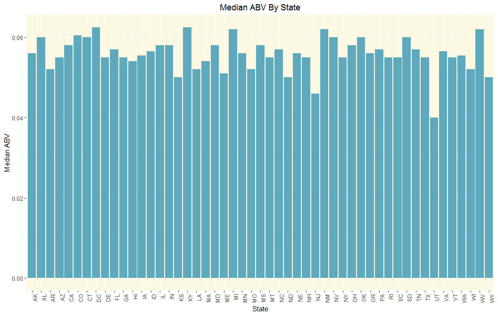
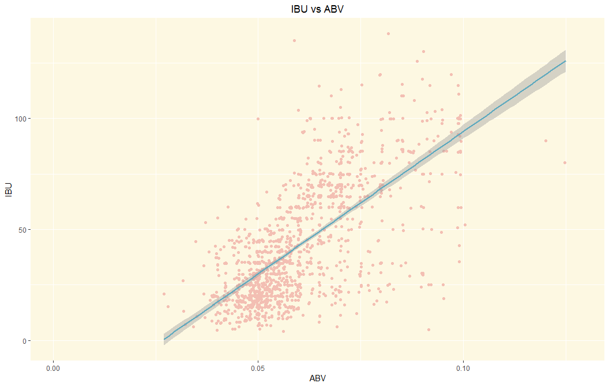

# Breweries and Beer, an analysis.
I was provided a dataset of breweries, and a dataset of beer, which will be analyzed to answer questions asked at the tail end of this document. In this document, I will address how this data was cleaned up, and analyzed, before presenting answers.

## Import the data:

```r
beers <- read.csv("data/Beers.csv")
breweries <- read.csv("data/Breweries.csv")
```

## First, how many breweries are in each state?

```r
table(breweries$State)
```

```
## 
##  AK  AL  AR  AZ  CA  CO  CT  DC  DE  FL  GA  HI  IA  ID  IL  IN  KS  KY 
##   7   3   2  11  39  47   8   1   2  15   7   4   5   5  18  22   3   4 
##  LA  MA  MD  ME  MI  MN  MO  MS  MT  NC  ND  NE  NH  NJ  NM  NV  NY  OH 
##   5  23   7   9  32  12   9   2   9  19   1   5   3   3   4   2  16  15 
##  OK  OR  PA  RI  SC  SD  TN  TX  UT  VA  VT  WA  WI  WV  WY 
##   6  29  25   5   4   1   3  28   4  16  10  23  20   1   4
```

## Merge the data by brewery ID, so we can move on with analysis.

```r
beersAndBreweries <- merge(beers, breweries, by.x = 'Brewery_id', by.y = 'Brew_ID')
#"Names" will be present in both, here is how I fixed that.
dfNames <- names(beersAndBreweries)
#Looking at the original data, col 2 was names for beers, and col 2 was names in breweries. 2+6 (-1 for brew_ID, which disappeared in the merge) = 8
dfNames[2] <- "Beer_Names"
dfNames[8] <- "Brewery_Names"
names(beersAndBreweries) <- dfNames
```

## Ensure it merged right:

```r
head(beersAndBreweries, 6)
```

```
##   Brewery_id    Beer_Names Beer_ID   ABV IBU
## 1          1  Get Together    2692 0.045  50
## 2          1 Maggie's Leap    2691 0.049  26
## 3          1    Wall's End    2690 0.048  19
## 4          1       Pumpion    2689 0.060  38
## 5          1    Stronghold    2688 0.060  25
## 6          1   Parapet ESB    2687 0.056  47
##                                 Style Ounces      Brewery_Names
## 1                        American IPA     16 NorthGate Brewing 
## 2                  Milk / Sweet Stout     16 NorthGate Brewing 
## 3                   English Brown Ale     16 NorthGate Brewing 
## 4                         Pumpkin Ale     16 NorthGate Brewing 
## 5                     American Porter     16 NorthGate Brewing 
## 6 Extra Special / Strong Bitter (ESB)     16 NorthGate Brewing 
##          City State
## 1 Minneapolis    MN
## 2 Minneapolis    MN
## 3 Minneapolis    MN
## 4 Minneapolis    MN
## 5 Minneapolis    MN
## 6 Minneapolis    MN
```

```r
tail(beersAndBreweries, 6)
```

```
##      Brewery_id                Beer_Names Beer_ID   ABV IBU
## 2405        556             Pilsner Ukiah      98 0.055  NA
## 2406        557  Heinnieweisse Weissebier      52 0.049  NA
## 2407        557           Snapperhead IPA      51 0.068  NA
## 2408        557         Moo Thunder Stout      50 0.049  NA
## 2409        557         Porkslap Pale Ale      49 0.043  NA
## 2410        558 Urban Wilderness Pale Ale      30 0.049  NA
##                        Style Ounces                 Brewery_Names
## 2405         German Pilsener     12         Ukiah Brewing Company
## 2406              Hefeweizen     12       Butternuts Beer and Ale
## 2407            American IPA     12       Butternuts Beer and Ale
## 2408      Milk / Sweet Stout     12       Butternuts Beer and Ale
## 2409 American Pale Ale (APA)     12       Butternuts Beer and Ale
## 2410        English Pale Ale     12 Sleeping Lady Brewing Company
##               City State
## 2405         Ukiah    CA
## 2406 Garrattsville    NY
## 2407 Garrattsville    NY
## 2408 Garrattsville    NY
## 2409 Garrattsville    NY
## 2410     Anchorage    AK
```
The merge was evidently successful, and the columns have useful names.

## There were a number of missing observations in this data, as reported below:

```r
colSums(is.na(beersAndBreweries))
```

```
##    Brewery_id    Beer_Names       Beer_ID           ABV           IBU 
##             0             0             0            62          1005 
##         Style        Ounces Brewery_Names          City         State 
##             0             0             0             0             0
```
The IBU's and ABV's are the two columns missing values.

## What is the median and mean ABV and IBU per state?
To do this, I'll use dplyr, which has better support for grouping, and ggplot2 for visualization.

```r
#Group it all!
library(dplyr)
groupedbnb <- group_by(beersAndBreweries, State)
#get statistics by state
medAbv <- summarize(groupedbnb, medABV = median(ABV, na.rm = TRUE))
medIBU <- summarize(groupedbnb, medIBU = median(IBU, na.rm = TRUE))
#plot it
library(ggplot2)
ggplot(medAbv, aes(x = State, y = medABV)) +
    geom_bar(stat = "identity", fill = "#5EA9BE") +
    theme(panel.background = element_rect(fill = "#FDF8E2"),
          axis.text.x = element_text(angle = 90, hjust = 1),
          plot.title = element_text(hjust = 0.5)) +
    labs(title = "Median ABV By State", y = "Median ABV")
```



```r
ggplot(medIBU, aes(x = State, y = medIBU)) +
    geom_bar(stat = "identity", fill = "#F3BFB3") +
    theme(panel.background = element_rect(fill = "#FDF8E2"),
          axis.text.x = element_text(angle = 90, hjust = 1),
          plot.title = element_text(hjust = 0.5)) +
    labs(title = "Median IBU By State", y = "Median IBU")
```


## Which state has the most alcoholic beer?

```r
#The highest ABV is:
highestABV <- max(beersAndBreweries$ABV, na.rm = TRUE)
highestABV
```

```
## [1] 0.128
```

```r
#The state with the highest ABV beer is:
as.character(beersAndBreweries$State[which(beersAndBreweries$ABV == highestABV)])
```

```
## [1] " CO"
```
Colorado, with an ABV of 0.128.

## Which state has the most bitter (Highest IBU) beer?

```r
#The highest ABV is:
highestIBU <- max(beersAndBreweries$IBU, na.rm = TRUE)
highestIBU
```

```
## [1] 138
```

```r
#The state with the highest ABV beer is:
as.character(beersAndBreweries$State[which(beersAndBreweries$IBU == highestIBU)])
```

```
## [1] " OR"
```
Oregon, with an IBU of 138.

## Some further statistics on ABV:

```r
summary(beersAndBreweries$ABV)
```

```
##    Min. 1st Qu.  Median    Mean 3rd Qu.    Max.    NA's 
## 0.00100 0.05000 0.05600 0.05977 0.06700 0.12800      62
```

```r
#This is easier to see in a histogram:
ggplot(beersAndBreweries, aes(x = ABV)) +
    geom_histogram(fill = "#5EA9BE", color = "#FFFFFF") +
    theme(panel.background = element_rect(fill = "#FDF8E2"))
```


A histogram is a better way to see all of this.

## Is there a correlation between IBU and ABV?
The client asked for a scatter plot, but a linear model and correlation coefficient helps here too!

```r
ggplot(beersAndBreweries, aes(x = ABV, y = IBU)) + 
    geom_jitter(color = "blue3") +
    geom_smooth(method = "lm")  +
    theme(panel.background = element_rect(fill = "#FDF8E2"),
          plot.title = element_text(hjust = 0.5)) +
    labs(title = "IBU vs ABV")
```



```r
cor(beersAndBreweries$ABV, beersAndBreweries$IBU, use = "complete.obs")
```

```
## [1] 0.6706215
```

```r
summary(lm(IBU ~ ABV, data = beersAndBreweries))
```

```
## 
## Call:
## lm(formula = IBU ~ ABV, data = beersAndBreweries)
## 
## Residuals:
##     Min      1Q  Median      3Q     Max 
## -78.849 -11.977  -0.721  13.997  93.458 
## 
## Coefficients:
##             Estimate Std. Error t value Pr(>|t|)    
## (Intercept)  -34.099      2.326  -14.66   <2e-16 ***
## ABV         1282.037     37.860   33.86   <2e-16 ***
## ---
## Signif. codes:  0 '***' 0.001 '**' 0.01 '*' 0.05 '.' 0.1 ' ' 1
## 
## Residual standard error: 19.26 on 1403 degrees of freedom
##   (1005 observations deleted due to missingness)
## Multiple R-squared:  0.4497,	Adjusted R-squared:  0.4493 
## F-statistic:  1147 on 1 and 1403 DF,  p-value: < 2.2e-16
```
As we can see, the Pearson correlation coefficient between ABV and IBU is 0.67, indicating a moderate correlation. We fit a simple linear regression model to the data. The model that describes the relationship between ABV and IBU is

> IBU = -34.099 + 1282.037*ABV

We obtained an R² value of 0.4497, indicating that the model explains about 45% of the variability of IBU. The plot also visually suggests that generally the higher the alcohol per volume, the more bitter a beer is.


